# eCRF Autofill — backend modulaire (V1)

Pipeline **orientée routing, extraction spécialisée par famille de champs et traçabilité**, sans prompt monolithique sur l'intégralité du document.

> Toutes les commandes opérationnelles (Docker, CI, pre-commit, debug) sont listées dans [`useful_commands.md`](./useful_commands.md).
>
> Le bilan technique du stage, les résultats avant/après et le guide de
> reproduction pour le superviseur sont dans
> [`docs/INTERNSHIP_HANDOVER.md`](./docs/INTERNSHIP_HANDOVER.md).

---

## Architecture

### Pipeline global

```mermaid
flowchart LR
  DOC["Document<br/>(PDF, TXT…)"] --> ING["Ingestion"]
  ING --> PAR["Parsing<br/>pypdf | Docling"]
  PAR --> STR["Structuring<br/>sections lab"]
  STR --> CHK["Chunking<br/>sections | lab"]
  CHK --> IDX["Indexation<br/>memory | Qdrant"]
  IDX --> RET["Retrieval<br/>dense + BM25 + rerank"]
  RET --> EXT["Extraction<br/>StudySchema"]
  EXT --> BR["Règles métier<br/>mapping · norm · score"]
  BR --> ETL["ETL<br/>JSON · CSV · XLS"]

  style EXT fill:#e8f4fc,stroke:#1a73e8
  style BR fill:#fef7e0,stroke:#f9ab00
```

### Démarche par document (orchestration)

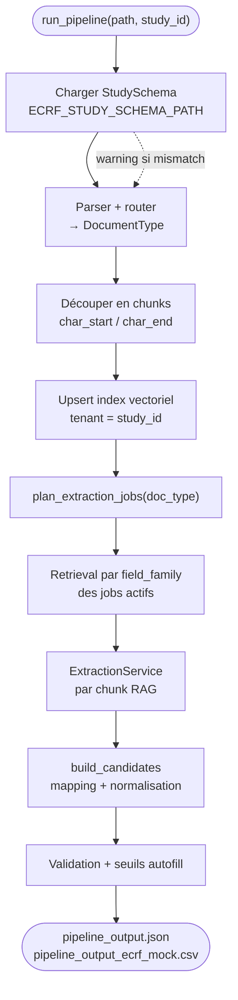

- **Ingestion / parsing / chunking** : `app/ingestion`, `app/parsing` (`SmartParsingService`, PDF via **pypdf** ou **Docling**, post-traitement labo via `LabReportPostProcessor`).
- **Structurer + segmenter** : `app/parsing/structuring.py` + `DoclingPdfParser` graph-aware ; fallback Markdown si la structure Docling est trop pauvre.
- **Chunking** : `SectionBasedChunkingService` (sections cliniques) ou `HeuristicLabChunkingService` (paragraphes labo). Span verification (`char_start`/`char_end`) garantie pour la traçabilité.
- **Routage documentaire** : `app/routing` (`DocumentRouter`).
- **Index / retrieval** : `app/indexing` (`InMemoryVectorIndexService` pour dev, `QdrantHybridVectorService` pour prod), `app/retrieval` (`RetrievalService`, orchestrateurs de workflow).
- **Extraction** : `app/extraction` — pilotée par `StudySchema` (JSON) : jobs par stratégie/famille, chunks RAG uniquement (`ExtractionService`, `plan_extraction_jobs`, stratégies lab / narratif / imagerie LangExtract+Ollama).
- **Règles métier** : `app/business_rules` (temporalité, mapping champs, validation, score).
- **ETL sortie** : `app/etl` (JSON, CSV mock, XLS réel et templates d'évaluation).
- **Orchestration** : `app/orchestration/pipeline.py` (`run_pipeline`).
- **Schémas** : `app/schemas` (Pydantic v2), dont `StudySchema` + `ExtractionCatalog`.
- **Schéma d'étude** : `data/study_schema_default.json` (ou `ECRF_STUDY_SCHEMA_PATH`) ; `app/config/ecrf_fields.py` sert au bootstrap / démo uniquement.

Workflow documentaire :

- `BaseWorkflowOrchestrator` + `LocalWorkflowOrchestrator` (V1, in-memory).
- `VectorStoreWorkflowOrchestrator` (V2, branché si `ECRF_VECTOR_BACKEND=qdrant`).
- `RagflowWorkflowOrchestrator` (TODO).

---

## Prérequis

| Élément | Recommandation |
|---|---|
| Python | **3.12 ou 3.13** (matrice CI testée). 3.11 fonctionne mais non testé en CI. **3.14 instable sur Windows** pour la stack hybride (fastembed/ONNX) — utilisez `dense_only` ou Docker. |
| Docker Desktop | Requis pour : Qdrant local, exécution conteneurisée de la suite (parité CI). |
| Disque | ~6 GiB libres (cache Hugging Face : e5 + bge-reranker + bm25). |
| Token HF | **Non nécessaire** pour les modèles publics. Uniquement si vous ajoutez un modèle « gated ». |

---

## Installation

### Locale (venv)

```powershell
cd "c:\Saima Work\AI4Cure\Code\rapid-flow"
python -m venv .venv
.\.venv\Scripts\activate

# Base + dev tools (pytest, ruff, mypy, pip-audit, pre-commit)
pip install -e ".[dev]"

# Stack vector store (Qdrant + embeddings + BM25 + reranker)
pip install -e ".[dev,vector]"

# Docling (parsing PDF complexes, OCR optionnel)
pip install -e ".[docling]"

# (optionnel) Couche LlamaIndex au-dessus de Qdrant
pip install -e ".[llamaindex]"
```

Copiez `.env.example` vers `.env` si besoin. Le fichier `.env` est chargé automatiquement (`app.config.settings`).

### Pré-télécharger les modèles HF (une fois, ~1.2 GiB)

```powershell
python -X utf8 scripts\prefetch_vector_models.py
```

Le script gère automatiquement : token expiré, fichier persisté `~/.cache/huggingface/token`, erreurs réseau Windows (`WinError 10054`/`10038`), absence du Mode Développeur (`WinError 1314`), et crashes ONNX au teardown.

### Activer pre-commit (optionnel mais recommandé)

```powershell
pre-commit install
pre-commit run --all-files   # premier check sur tout le repo
```

---

## Parsing PDF et bilans sanguins

- **Contrat** : le pipeline consomme toujours un `ParsedDocument` (`full_text`, `metadata`, `structured_sections`, `structured_lab_lines`, `source_path`, …).
- **Orchestrateur** : `SmartParsingService` route les **PDF** vers une pile PDF locale, les **.txt/.md** vers `HeuristicTextParser`.
- **PDF parsers** :
  - `PypdfPdfParser` — défaut / secours, 100 % local.
  - `DoclingPdfParser` — recommandé si installé (sectionnement graph-aware, headers/footers filtrés, tables matérialisées).
  - Mode **`auto`** : tente Docling puis retombe sur pypdf en cas d'erreur (réseau / 401 / absence de modèles).
- **Sectionnement** : `DoclingPdfParser` priorise `document.iterate_items()` (graph) pour produire des `DocumentSection` propres. Fallback Markdown `##` si le graph est trop pauvre.
- **Chunking** : `SectionBasedChunkingService` (sections cliniques) — taille max `ECRF_CHUNK_MAX_SECTION_CHARS` (défaut 12 000 caractères). Pour bilans sanguins : `HeuristicLabChunkingService`.
- **Post-traitement labo** : `LabReportPostProcessor` remplit `structured_lab_lines` pour les PDF « bilan » détectés (scoring contextuel par `is_probable_lab_document`).

Voir [Scripts de démo (par étape pipeline)](#scripts-de-démo-par-étape-pipeline) pour `run_demo_parsing.py`.

---

## Vector store : Qdrant + dense + BM25 + reranker

### Démarrer Qdrant local

```powershell
docker compose -f docker-compose.qdrant.yml up -d
curl http://localhost:6533/healthz   # attendu : "healthz check passed"
start http://localhost:6533/dashboard
```

Notre conteneur écoute sur **6533** (REST) / **6534** (gRPC) pour cohabiter avec un autre Qdrant local (typiquement starter-kit n8n sur 6333).

### Configurer la pipeline pour Qdrant

Dans `.env` :

```ini
ECRF_VECTOR_BACKEND=qdrant
ECRF_QDRANT_URL=http://localhost:6533
ECRF_ENABLE_SPARSE_BM25=true     # désactiver sur Python 3.14 + Windows
ECRF_ENABLE_RERANKER=true
```

### Isolation tenant

Une **collection par tenant** (option C) : nom = `{ECRF_QDRANT_COLLECTION_PREFIX}__{tenant_id_normalisé}`. Le `tenant_id` est obligatoire dans `upsert_chunks` / `search` / `delete_document` (`ValueError` sinon). Par défaut le pipeline passe `study_id` comme `tenant_id`.

### Recherche hybride

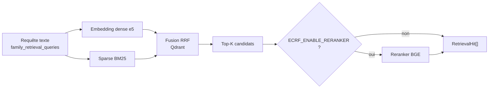

---

## Scripts de démo (par étape pipeline)

Cinq scripts couvrent **des tranches différentes** de la chaîne. `run_demo_e2e.py` exécute la pipeline **métier complète** sur les documents de démonstration ; `run_dataset_extraction.py` la rejoue sur un dataset apparié avant que `run_evaluation.py` calcule les métriques.

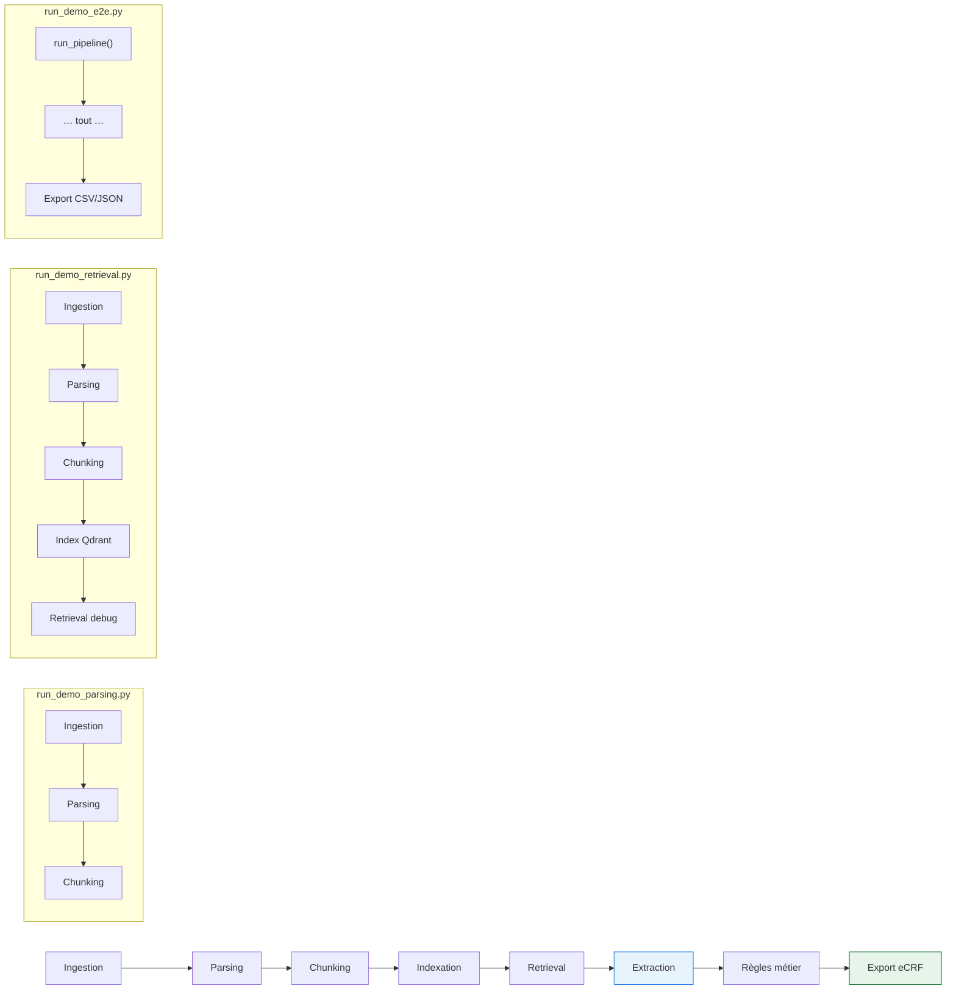

| Script | Étapes couvertes | Extraction | Prérequis | Entrée par défaut |
|--------|------------------|------------|-----------|-------------------|
| **`run_demo_parsing.py`** | ingestion → parsing → chunking | Non | Python + deps parsing | PDF/TXT (argument) |
| **`run_demo_retrieval.py`** | + index Qdrant hybride + retrieval + dumps JSON | Non | Qdrant + modèles HF (~1,5 Go) | `data/ct_scan_report_liver.pdf` |
| **`run_demo_e2e.py`** | pipeline produit complète via `run_pipeline()` | **Oui** (lab + imagerie) | deps de base ; Ollama pour RECIST ; Qdrant si `ECRF_VECTOR_BACKEND=qdrant` | `mock_blood_panel.txt` + `data/ct_scan_report_liver.pdf` |
| **`run_dataset_extraction.py`** | pipeline complète en lot → `extracted/` | **Oui** | mêmes prérequis que les documents du dataset | dataset apparié passé par `--dataset-root` |
| **`run_evaluation.py`** | appariement dataset → métriques champs/valeurs + Recall@k silver | Non (prédictions sauvegardées) | deps de base ; backend retrieval configuré sauf `--skip-retrieval` | `data/{reports,filtered_templates,extracted}` |

### `run_demo_parsing.py` — parsing seul

Déboguer Docling/pypdf, sections, `document_type_hint`, lignes labo structurées — **sans** Qdrant ni LLM.

```powershell
python scripts\run_demo_parsing.py "data\ct_scan_report_liver.pdf"
python scripts\run_demo_parsing.py "data\ct_scan_report_liver.pdf" --backend pypdf --json-out parsed.json
```

### `run_demo_retrieval.py` — index + retrieval (sans extraction)

Valider la couche RAG sur un PDF imagerie : upsert Qdrant, scores dense/BM25/rerank, `health_check`, `list_chunks`, artefacts JSON (`--dump-dir`). **Ne passe pas** par `PipelineOrchestrator` (pas d'extraction, pas d'export eCRF).

```powershell
docker compose -f docker-compose.qdrant.yml up -d
python scripts\run_demo_retrieval.py
python scripts\run_demo_retrieval.py --dump-dir outputs\demo_ct --dump-full-text
python scripts\run_demo_retrieval.py --no-sparse --no-reranker --keep-indexed
```

### `run_demo_e2e.py` — pipeline produit complète

Appelle `run_pipeline()` sur **deux documents** :

1. **`scripts/sample_data/mock_blood_panel.txt`** — extraction `lab_deterministic` (AST, ALT, AFP, …)
2. **`data/ct_scan_report_liver.pdf`** — extraction `imaging_langextract` (taille lésion, RECIST) via Ollama

Sorties : un dossier `outputs/<document_id>/` par document (`pipeline_output.json` + CSV mock).

```powershell
python scripts\run_demo_e2e.py
python scripts\run_demo_e2e.py --lab-only          # sans imagerie / sans Ollama
python scripts\run_demo_e2e.py --imaging-only      # CR TDM seul
```

Prérequis imagerie : `ECRF_LANGEXTRACT_ENABLED=true`, `ollama serve`, `ollama pull gemma2:2b` (ou modèle `.env`).

PDF imagerie seul (sans le script) :

```powershell
python -c "from app.config.settings import Settings; from app.config.study_schema_provider import resolve_study_schema; from app.orchestration.pipeline import run_pipeline; s=resolve_study_schema(Settings().study_schema_path); print(run_pipeline('data/ct_scan_report_liver.pdf', 'PAT-1', s.study_id).export_paths)"
```

### `run_evaluation.py` — évaluation automatique du dataset

Le script apparie les fichiers par `sample_id` :

```text
data/reports/<sample_id>.pdf
data/filtered_templates/empty/<sample_id>_template_empty.json
data/filtered_templates/filled/<sample_id>_template_filled.json
data/extracted/<sample_id>_template.json
```

Le template vide définit les champs évaluables, le template rempli et vérifié est le gold,
et `extracted/` contient les prédictions sauvegardées. Les champs extraits hors template sont
signalés mais exclus des métriques de présence.

```powershell
# Rejouer la pipeline sur tous les PDF labellisés et créer `extracted/`
python scripts\run_dataset_extraction.py --dataset-root data --workers 2 --overwrite

# Évaluer les prédictions sauvegardées
python scripts\run_evaluation.py
python scripts\run_evaluation.py --skip-retrieval
python scripts\run_evaluation.py --k 1 3 5 --min-f1 0.90 --min-value-accuracy 0.95
```

Le rapport `outputs/evaluation/<run_id>/evaluation_report.json` contient les résultats par
échantillon, les agrégats micro/macro, les TP/FP/FN, le taux de validation contractuelle,
le taux d'autofill, le false-autofill, précision/rappel/F1 et l'accuracy des valeurs.

`silver_recall_at_k` n'est pas une annotation humaine : les qrels sont dérivées avant le
classement en recherchant un couple exact libellé + valeur gold dans les chunks, puis les
chunks sont classés avec les requêtes de famille utilisées en production. Les champs sans
correspondance unique ou sans famille de retrieval supportée sont exclus du dénominateur et
listés comme `unmatched`, `ambiguous` ou `unsupported_family`. Utiliser `--skip-retrieval`
pour ne calculer que les métriques de champs.

### Quel script choisir ?

| Besoin | Script |
|--------|--------|
| « Mon PDF est-il bien parsé ? » | `run_demo_parsing.py` |
| « Qdrant retrouve-t-il les bonnes sections ? » | `run_demo_retrieval.py` |
| « Le pipeline remplit-il les champs eCRF ? » | `run_demo_e2e.py` |
| « Comment régénérer toutes les prédictions d'un dataset ? » | `run_dataset_extraction.py` |
| « Quelle est la qualité agrégée des extractions sauvegardées ? » | `run_evaluation.py` |

> **`run_demo_e2e.py` ≠ `run_demo_retrieval.py` + extraction.** L'e2e utilise `PipelineOrchestrator` (retrieval piloté par le StudySchema, pas les requêtes ad hoc du script retrieval). Le script retrieval ajoute des outils de debug Qdrant absents de l'e2e (`health_check`, `list_chunks`, dumps JSON).

### Via Docker (`docker-compose.dev.yml`)

Alternative au venv local — recommandée pour **`run_demo_retrieval.py`** et la stack Qdrant hybride sur Windows. Image `rapid-flow:dev` (target `test` : Python 3.13 Linux, extras `[vector]` + `[docling]`).

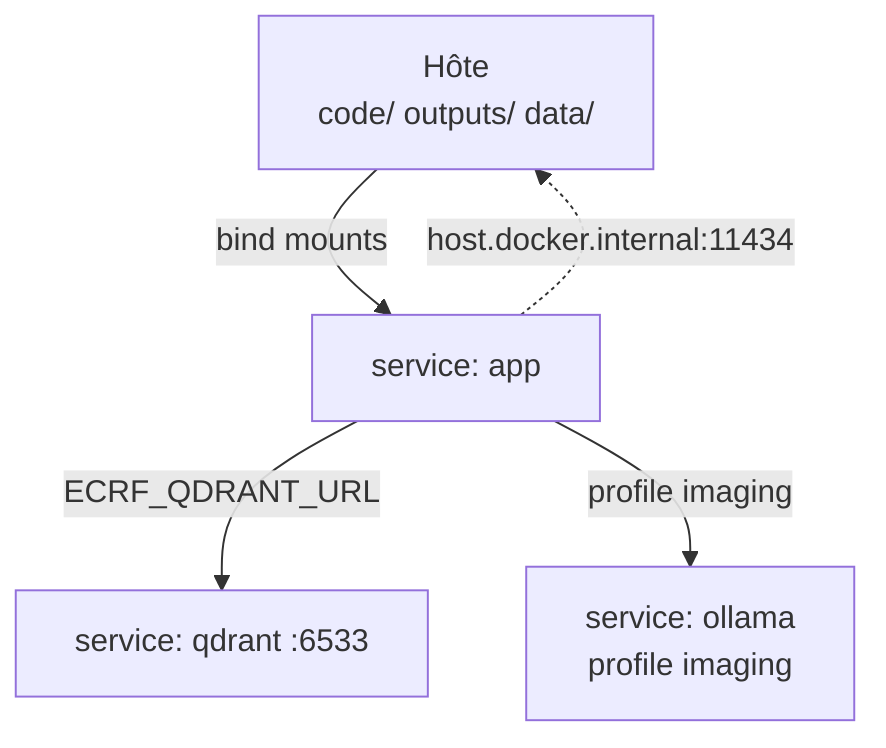

| Service | Rôle |
|---------|------|
| **`qdrant`** | Index vectoriel (ports hôte 6533/6534) |
| **`app`** | Conteneur de dev : code monté live, cache HF persistant |
| **`ollama`** (profile `imaging`) | LLM conteneurisé pour extraction imagerie |

**Build (une fois, ~5 Go) :**

```powershell
docker compose -f docker-compose.dev.yml build app
```

**Commandes :**

```powershell
# Qdrant (retrieval / e2e avec vector backend)
docker compose -f docker-compose.dev.yml up -d qdrant

# 1. Parsing seul — sans démarrer Qdrant
docker compose -f docker-compose.dev.yml run --rm --no-deps app `
  python scripts/run_demo_parsing.py data/ct_scan_report_liver.pdf

# 2. Retrieval hybride
docker compose -f docker-compose.dev.yml run --rm app `
  python scripts/run_demo_retrieval.py --dump-dir outputs/demo_ct --dump-full-text

# 3. Pipeline e2e (memory, sans Qdrant)
docker compose -f docker-compose.dev.yml run --rm --no-deps app `
  python scripts/run_demo_e2e.py

# 4. Pipeline e2e + Qdrant (ECRF_VECTOR_BACKEND=qdrant dans le compose)
docker compose -f docker-compose.dev.yml run --rm app `
  python scripts/run_demo_e2e.py

# Shell interactif
docker compose -f docker-compose.dev.yml run --rm app bash
```

**Ollama (extraction imagerie RECIST) :**

- Ollama sur l’hôte (défaut) : `ollama serve` + `ollama pull gemma2:2b` — le conteneur utilise `http://host.docker.internal:11434`.
- Ollama conteneurisé :

```powershell
docker compose -f docker-compose.dev.yml --profile imaging up -d ollama
docker compose -f docker-compose.dev.yml run --rm -e ECRF_OLLAMA_URL=http://ollama:11434 app `
  python scripts/run_demo_e2e.py
```

Volumes partagés : cache HF (`rapid_flow_hf_cache`, réutilisable avec `docker-compose.test.yml`), `outputs/` et `data/` sur l’hôte.

---

## Extraction (StudySchema)

L'extraction ne lit **jamais** le document entier en une fois : elle consomme les **chunks** renvoyés par le retrieval, avec traçabilité (`source_chunk_id`, score RAG, span texte).

### Flux extraction (vue d'ensemble)

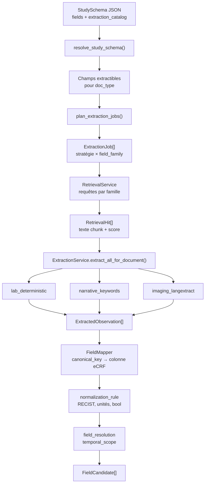

### Planification des jobs

Les champs du schéma sont **regroupés** : un job = une paire `(extraction_strategy, field_family)` partageant les mêmes hits RAG.

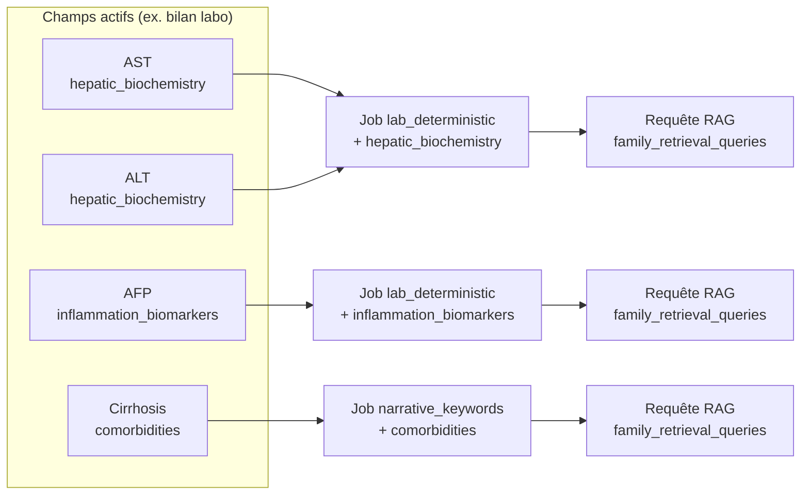

### Choix de stratégie

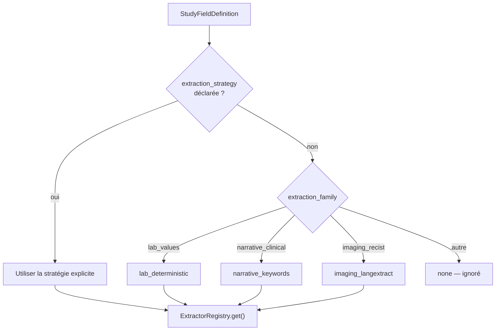

### Traitement d'un chunk (séquence)

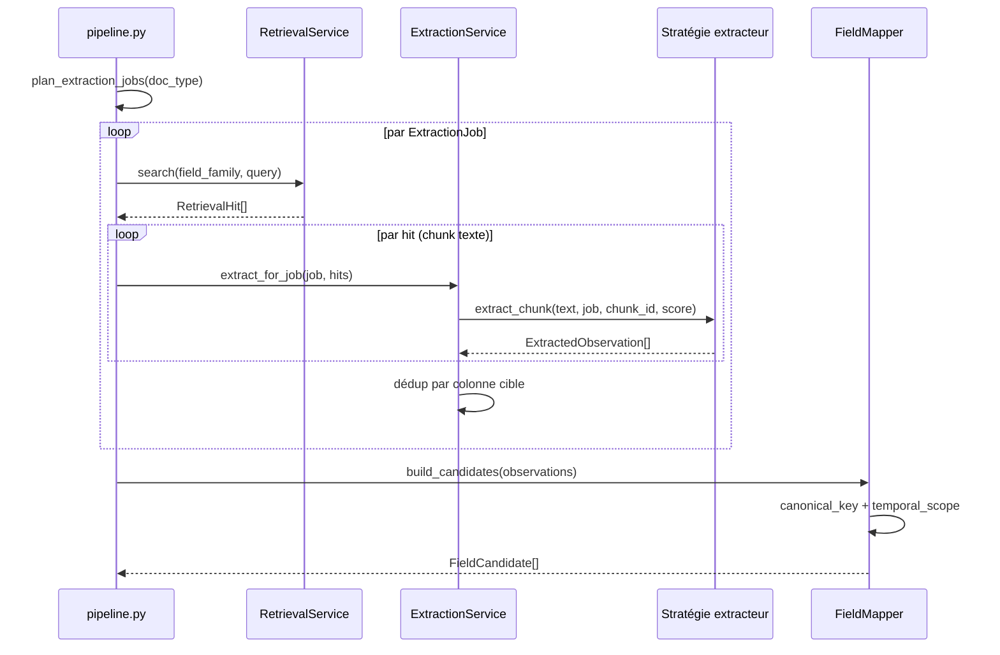

### Imagerie : parallélisation LangExtract

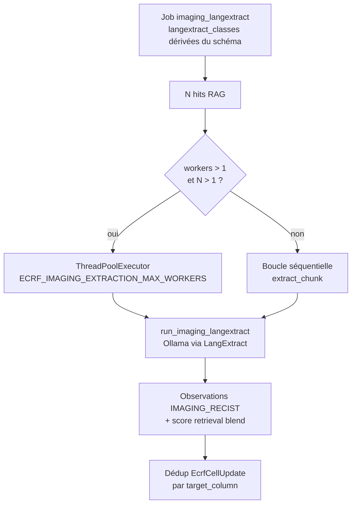

### Schéma d'étude (`StudySchema`)

Fichier par défaut : [`data/study_schema_default.json`](./data/study_schema_default.json).

Chaque champ actif déclare notamment :

| Propriété | Rôle |
|-----------|------|
| `canonical_key` | Clé d'observation (ex. `AST`, `RECIST_response`) |
| `extraction_strategy` | `lab_deterministic`, `narrative_keywords`, `imaging_langextract` |
| `field_family` | Famille retrieval + dédup (ex. `hepatic_biochemistry`, `imaging_recist`) |
| `document_types_allowed` | Types de documents éligibles |
| `temporal_scope` | Désambiguïsation si plusieurs colonnes partagent une clé |
| `normalization_rule` | Règle métier (ex. `recist_category`, `numeric_mm`) |
| `langextract_class` | Classe LangExtract pour l'imagerie (optionnel) |

Le bloc optionnel `extraction_catalog` dans le JSON permet d'étendre sans recompiler :

- `lab_analytes` — patterns regex par analyte (`LabAnalyteSpec`)
- `narrative_keywords` — mots-clés booléens / catégoriels (`NarrativeKeywordSpec`)
- `langextract_class_map` / `langextract_class_descriptions` — classes imagerie custom

Chargement : `app/config/study_schema_provider.py` (`resolve_study_schema`). Si `ECRF_STUDY_SCHEMA_PATH` est vide, le fichier `data/study_schema_default.json` est utilisé ; sinon repli sur les champs exemple de `ecrf_fields.py`.

### Stratégies d'extracteurs

| Stratégie | Module | Usage |
|-----------|--------|--------|
| `lab_deterministic` | `strategy_extractors.LabDeterministicStrategy`, `lab_heuristics.py` | Bilans : AST, AFP, plaquettes, etc. |
| `narrative_keywords` | `NarrativeKeywordsStrategy` | Comorbidités, antécédents (ex. cirrhose) |
| `imaging_langextract` | `ImagingLangextractStrategy`, `imaging_langextract.py` | RECIST, tailles en mm, conclusions radiologiques |

Registre : `ExtractorRegistry` dans `app/extraction/strategy_extractors.py`. Orchestration : `app/extraction/service.py` (dédup par colonne cible, parallélisation imagerie via `ThreadPoolExecutor`).

Classes LangExtract par défaut : `lesion_size_mm`, `recist_response`, `lesion_description`, `imaging_conclusion` (dérivée si le schéma demande `RECIST_response`). Normalisation RECIST → codes canoniques `CR|PR|SD|PD|NE` (`app/business_rules/normalization.py`).

### Imagerie : Ollama + LangExtract

Prérequis pour l'extraction imagerie **réelle** (hors tests mockés) :

```powershell
# Ollama local
ollama pull gemma2:2b    # ou le modèle défini dans .env
ollama serve
pip install langextract   # si absent du venv
```

Variables `.env` (préfixe `ECRF_`, voir `.env.example`) :

```ini
ECRF_LANGEXTRACT_ENABLED=true
ECRF_OLLAMA_MODEL_ID=gemma2:2b
ECRF_OLLAMA_URL=http://localhost:11434
ECRF_OLLAMA_TIMEOUT_S=120
ECRF_IMAGING_EXTRACTION_MAX_WORKERS=8
ECRF_STUDY_SCHEMA_PATH=./data/study_schema_default.json
ECRF_LANGEXTRACT_SCHEMA_VERSION=imaging-recist-langextract-v1
```

`ECRF_LANGEXTRACT_ENABLED=false` désactive les appels Ollama (aucune observation LLM imagerie).

### Règles métier post-extraction

- **Mapping** : `app/business_rules/mapping.py` — résolution champ eCRF via `canonical_key` + type de document.
- **Temporalité** : `app/business_rules/field_resolution.py` — priorité de `temporal_scope` (ex. baseline lab, `first_imaging` pour RECIST).
- **Normalisation** : `app/business_rules/normalization.py` — unités, booléens, catégories RECIST.

Le pipeline (`app/orchestration/pipeline.py`) charge le schéma, planifie les jobs, restreint le retrieval aux familles concernées, puis appelle `extract_all_for_document`.

### Personnaliser une étude

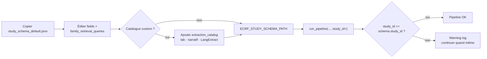

1. Copier `data/study_schema_default.json` vers `data/study_schema_<study_id>.json`.
2. Ajuster `fields`, `family_retrieval_queries` et éventuellement `extraction_catalog`.
3. Pointer `ECRF_STUDY_SCHEMA_PATH` vers ce fichier et aligner `study_id` passé à `run_pipeline` avec `study_schema.study_id` (warning si divergence).

Adaptateur **XLS/CSV** (`MA_Base_example.xlsx` → JSON) : prévu ; non branché en V1.

### Fichiers clés

```
app/schemas/study_schema.py          # StudySchema, ExtractionJob, stratégies
app/schemas/extraction_catalog.py    # catalogue lab / narratif / LangExtract
app/config/study_schema_provider.py
app/extraction/planner.py
app/extraction/service.py
app/extraction/strategy_extractors.py
app/extraction/imaging_langextract.py
app/extraction/imaging_config.py
data/study_schema_default.json
```

---

## Tests

### Suite par défaut (rapide, sans Qdrant ni Docker)

```powershell
# Tout (mode `memory`, isolé via fixture autouse)
pytest -q

# Avec couverture (gate à 70 %)
pytest -q --cov=app --cov-fail-under=70

# Verbose + raison des skips
pytest -v -rs

# Par marker
pytest -m ct_integration_pdf
pytest -m real_vector_backend
```

### Tests extraction (unitaires + intégration)

Sous PowerShell, les globs `tests/test_extraction_*.py` ne sont **pas** développés par pytest — utiliser l'une des commandes suivantes :

```powershell
# Tous les tests dont le nom contient "extraction" (+ schéma / imagerie)
python -m pytest tests/ -k "extraction or study_schema_extraction or imaging_langextract" -q

# Liste explicite des fichiers extraction
python -m pytest @(Get-ChildItem tests\test_extraction_*.py).FullName tests\test_study_schema_extraction.py tests\test_imaging_langextract.py -q

# Intégration pipeline extraction seule (LangExtract mocké pour l'imagerie)
python -m pytest tests\test_extraction_integration.py -q
```

Fichiers principaux :

| Fichier | Couverture |
|---------|------------|
| `test_extraction_catalog_and_schema.py` | Validation JSON, catalogue |
| `test_extraction_planner.py` | Planification des jobs |
| `test_extraction_lab_and_narrative.py` | Heuristiques lab / narratif |
| `test_extraction_normalization.py` | RECIST, unités |
| `test_extraction_field_resolution.py` | Scopes temporels |
| `test_extraction_mapping_dynamic.py` | Mapping dynamique |
| `test_extraction_imaging_config.py` | Config LangExtract par job |
| `test_extraction_service_unit.py` | Orchestration service |
| `test_extraction_strategies_unit.py` | Stratégies isolées |
| `test_extraction_integration.py` | E2E lab + imagerie (mock) |
| `test_imaging_langextract.py` | Parsing LangExtract / RECIST |
| `tests/extraction_fixtures.py` | Helpers partagés |

Test **réel** Ollama sur PDF CT (lent, opt-in) :

```powershell
python -m pytest tests\test_ct_scan_report_integration.py -v
```

### Tests d'intégration Qdrant (opt-in)

```powershell
docker compose -f docker-compose.qdrant.yml up -d
$env:ECRF_RUN_QDRANT_INTEGRATION="1"
pytest -v tests\test_qdrant_integration.py
Remove-Item Env:ECRF_RUN_QDRANT_INTEGRATION
```

Deux tests :
- `test_qdrant_end_to_end_hybrid` : dense + BM25 + RRF (auto-skip sur Python 3.14 + Windows).
- `test_qdrant_end_to_end_dense_only` : dense seul (compatible toutes plateformes).

### Tests conteneurisés (parité avec la CI)

```powershell
# Suite par défaut dans Python 3.13 Linux
docker compose -f docker-compose.test.yml run --rm test-runner

# Intégration Qdrant complète (la voie hybride passe vraiment ici)
docker compose -f docker-compose.test.yml --profile integration up -d qdrant
docker compose -f docker-compose.test.yml --profile integration run --rm test-integration
```

---

## Qualité de code

| Outil | Rôle | Config |
|---|---|---|
| **ruff** | lint + format | `[tool.ruff]` dans `pyproject.toml` |
| **mypy** | type check | `[tool.mypy]` (mode souple, `python_version = "3.12"`) |
| **pip-audit** | CVE deps | déclenché dans CI (`--strict --skip-editable`) |
| **pytest-cov** | couverture | gate **70 %** au démarrage, à monter |
| **pre-commit** | hooks Git | `.pre-commit-config.yaml` (ruff + mypy + hygiène fichiers) |

Commandes :

```powershell
ruff check app tests scripts            # lint
ruff format --check app tests scripts   # format
mypy app                                # types
pip-audit --strict --skip-editable      # CVE
```

---

## CI GitHub Actions

Trois workflows dans `.github/workflows/` :

| Workflow | Trigger | Effet |
|---|---|---|
| `ci.yml` | `push main` + `pull_request` | lint+type+audit / tests-unit matrix (3.12+3.13) / tests-integration Qdrant |
| `release.yml` | tag `v*.*.*` | rejoue CI puis push image `runtime` sur `ghcr.io/<owner>/<repo>` |

Optimisations CI :
- Cache pip (clé : hash de `pyproject.toml`)
- Cache HuggingFace (clé : hash de `app/config/settings.py`)
- `concurrency` : annule les anciens runs sur la même PR

Reproduire en local : voir [`useful_commands.md`](./useful_commands.md#10-ci-github-actions).

---

## Brancher plus tard les intégrations

| Brique | Emplacement | Action suivante |
|--------|-------------|-----------------|
| **RAGFlow** | `app/retrieval/workflow_orchestrator.py` → `RagflowWorkflowOrchestrator` | Implémenter appels HTTP/SDK ; mapper JSON → `RetrievalHit`. |
| **LangExtract imagerie** | `app/extraction/imaging_langextract.py` | Branché (Ollama) pour RECIST / tailles ; étendre via `extraction_catalog` dans le JSON d'étude. |
| **Llama fine-tuné** | `app/extraction/llama_extractor.py` | Injecté mais non utilisé par les stratégies V1 ; brancher si besoin hors LangExtract. |
| **StudySchema XLS** | `data/MA_Base_example.xlsx` | Générer `study_schema.json` depuis la base MA (adaptateur à implémenter). |
| **LlamaIndex layer** | extra `[llamaindex]` | `VectorStoreIndex` + `QdrantVectorStore` ; filtres metadata (`document_id`, `field_family`). Optionnel : la couche bas-niveau (`QdrantHybridVectorService`) suffit déjà. |
| **XLS réel** | `app/etl/export.py` | Implémenter `XlsExportPlaceholder` avec `openpyxl`. |
| **Pseudonymisation HDS** | TODO | Hooks pré-indexation pour anonymiser les identifiants nominatifs. |
| **CLI réindexation** | TODO | Outil pour rejouer l'indexation après changement d'`embedding_version`. |
| **OpenTelemetry** | TODO | Traces + métriques pipeline (Qdrant client, embeddings, retrieval). |

---

## Point d'entrée pipeline

```python
from app.orchestration.pipeline import run_pipeline

result = run_pipeline("chemin/vers/doc.txt", patient_id="P1", study_id="S1")
```

Les observations restent des `ExtractedObservation` (intermédiaires) jusqu'au mapping `FieldCandidate` → `EcrfCellUpdate`.

---

## Variables d'environnement

Préfixe `ECRF_`. Liste complète dans `app/config/settings.py`. Les plus utilisées sont documentées dans la section 7 de [`useful_commands.md`](./useful_commands.md#7-variables-denvironnement-utiles-préfixe-ecrf_).

---

## Arborescence

```
app/
  ingestion/
  parsing/
    pdf/
  indexing/          # InMemory + QdrantHybridVectorService + embeddings + sparse + reranker
  retrieval/
  extraction/        # planner, service, strategy_extractors, imaging_langextract
  routing/
  business_rules/
  etl/
  api/
  schemas/
  config/
  utils/
  orchestration/
tests/               # test_extraction_*.py, extraction_fixtures.py
scripts/             # run_demo_parsing | run_demo_retrieval | run_demo_e2e + prefetch_vector_models.py
data/                # study_schema_default.json, PDF/TXT démo
docs/
.github/
  workflows/         # ci.yml + release.yml
Dockerfile           # multi-stages: base / runtime / vector / test
docker-compose.qdrant.yml   # Qdrant local seul
docker-compose.dev.yml      # démos run_demo_* conteneurisées
docker-compose.test.yml     # parité CI conteneurisée
```
