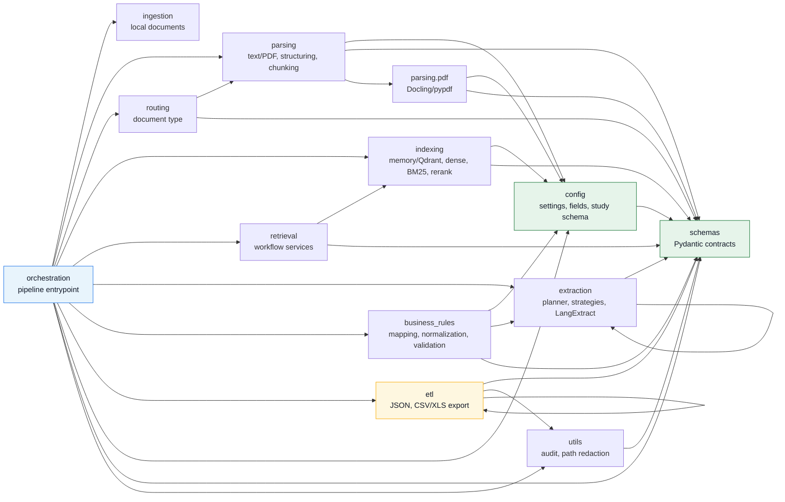
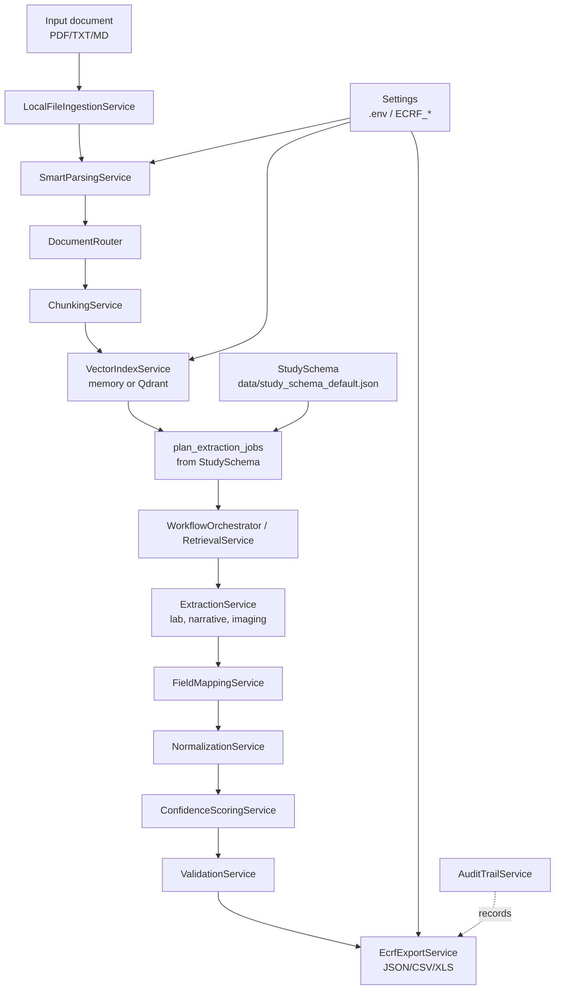

# Graphify: rapid-flow

Generated from the current `app/` package imports and the documented pipeline.

## Package Dependency Graph

## Runtime Flow

## Main Hubs

| Hub | Role | Key collaborators |
| --- | --- | --- |
| `app/orchestration/pipeline.py` | Assembles the end-to-end pipeline | ingestion, parsing, routing, indexing, retrieval, extraction, business rules, ETL |
| `app/schemas/*` | Shared contracts and enums | nearly every package |
| `app/config/study_schema_provider.py` | Loads the dynamic study schema | extraction planner, field registry, pipeline |
| `app/extraction/service.py` | Runs extraction jobs over retrieval hits | planner, strategy registry, schemas |
| `app/indexing/qdrant_vector_service.py` | Production vector backend | settings, embeddings, sparse encoder, reranker, schemas |
| `app/etl/export.py` | Materializes pipeline results | XLS helpers, overwrite policy, path redaction |

## Architectural Notes

- `schemas` is the stable inner layer; it should avoid depending on operational packages.
- `orchestration` intentionally has the broadest fan-in because it wires the application.
- `business_rules.normalization` imports RECIST helpers from `extraction.imaging_langextract`; if that grows, consider moving shared RECIST normalization into `business_rules` or `schemas`.
- `etl` and `extraction` contain several internal imports, which is expected because both packages have strategy/helper submodules.
